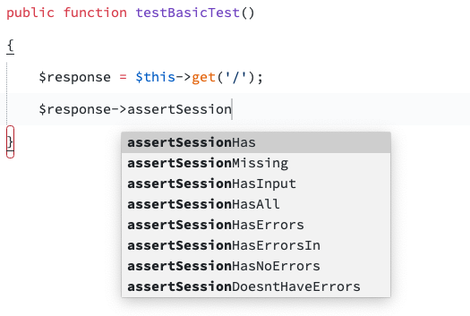

# Laravel Assertion Completions

Autocompletes the Laravel assertion. 

## Installation

Install by cloning the repository into your Sublime Text install's `Packages` folder:

```bash
git clone https://github.com/builtbyeleven/laravel-assertion-completions.git ~/Library/Application\ Support/Sublime\ Text\ 3/Packages/laravel-assertion-completions
```

## Screenshots



## Bugs

Please submit an issue or make a pull request.